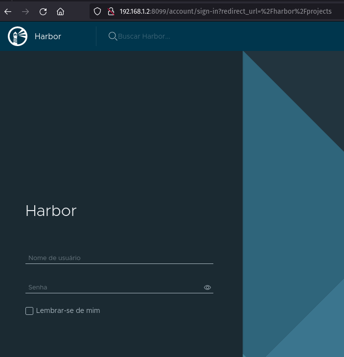

#vagrant_ansible_harbor  

*Repositorio para instalacao do harbor repositorio de imagem do docker*

### Usado
* Fedora 34
* Vagrant
* Harbor
* Ansible (provisionado pelo vagrant)
* Docker


### Para executar 

```
    vagrant up
```

### Resultado
